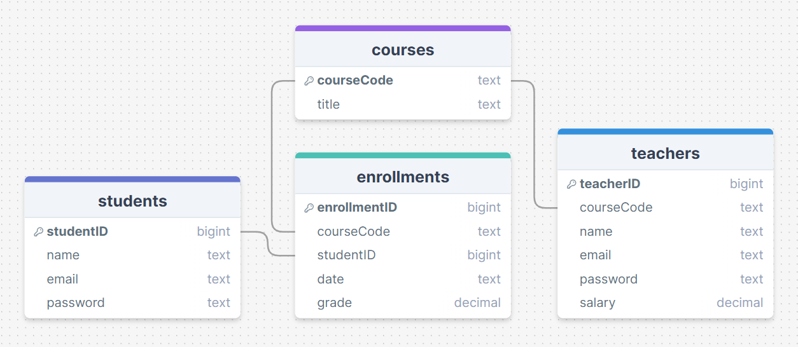
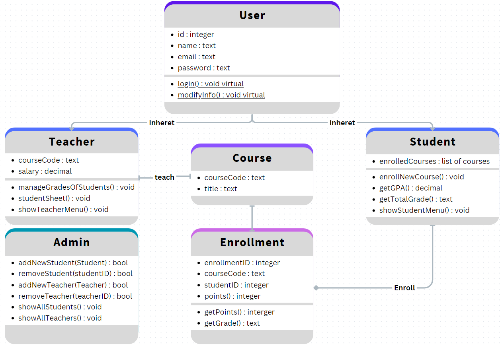
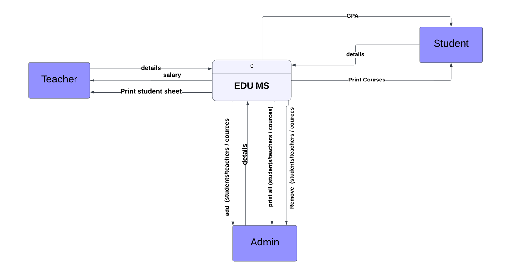
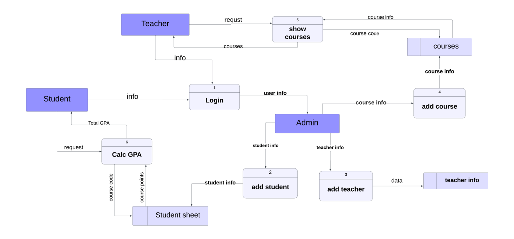

# OOP Project - Programming 2 CS203

## Table of Contents
- [Introduction](#introduction)
- [Database Schema](#database-schema)
- [SRS](resources/md/SRS.md)
- [UML](#uml)
- [DFD](#dfd)
  - [Context Level](#context-level)
  - [Level 0](#level-0)

## Introduction
> This project is a simple implementation of a educational management system. The system is designed to manage courses, students, and teachers. The system is implemented using Object-Oriented Programming principles in C++, and SQlite for the database.

> Database operations are handled using the [SQLiteCpp](https://github.com/SRombauts/SQLiteCpp) library. The system is designed to be simple and easy to use. The system is designed to be used by students, teachers, and administrators. The system provides functionalities for students to enroll in courses, view/delete enrolled courses, calculate GPA, view/modify personal info, view schedule, and log in. Teachers can view courses, manage grades, view student info, modify info, and login. Administrators can login, add, remove and modify students and teachers and courses. The system can manage course details, enroll, remove students and print course details.

## Database Schema
> The database schema is as follows:

## SRS
> The Software Requirements Specification document can be found [here](resources/md/SRS.md)

## UML
> The UML diagram is as follows:

## DFS

### Context Level
> The context level DFD is as follows:

### Level 0
> The level 0 DFD is as follows:
